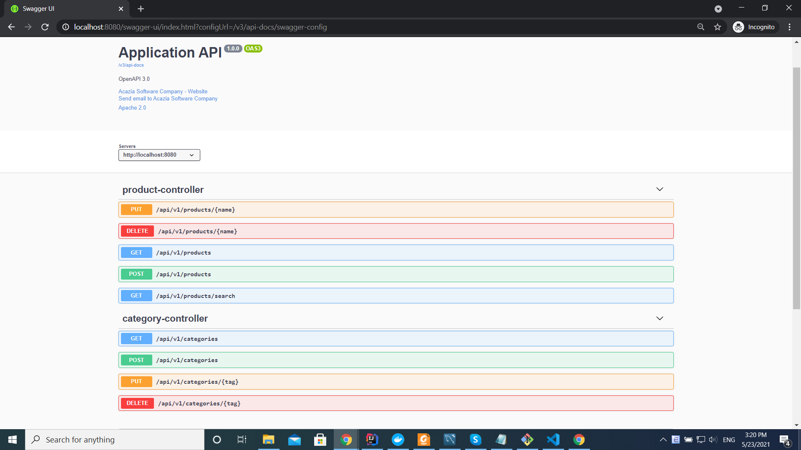

# Acazia-Test-Java-Spring (for java 1.8 +)

## Test-java-spring of Acazia software company

- Cho 2 entity:

  - Category với thuộc tính là: name (String), tag (String, unique)
  - Product với thuộc tính là: name (String), categoryTag (String), price (double)

- Quan hệ giữa 2 entity:

  - product n-1 category

- Yêu cầu:

  - xây dựng hệ thống với các layer: controller, service, repository
  - viết các API CRUD cho 2 entity trên
  - viết 1 API đáp ứng yêu cầu sau:
    nhận vào 1 String, trả về danh sách các product có thuộc tính categoryTag và categoryName sao cho categoryName gần giống với input (like %) và được sắp xếp theo: `price` giảm dần, trường hơp `price` bằng nhau thì sắp xếp theo `name` tăng dần (không phân biệt hoa thường).

- Ví dụ:

  - category:

    - [
      - {"name":"may tinh", "tag":"mt"},
      - {"name":"dien lanh", "tag":"dl"}
    - ]

  - product:

    - [
      - {"name":"may tinh xach tay A", "categoryTag":"mt", "price":12.0},
      - {"name":"laptop X", "categoryTag":"mt", "price":13.0},
      - {"name":"pc 2", "categoryTag":"mt", "price":13.0},
      - {"name":"ultrabook EZ", "categoryTag":"mt", "price":16.0},
      - {"name":"tu lanh e", "categoryTag":"dl", "price":11.5},
      - {"name":"dieu hoa nhiet do b", "categoryTag":"dl", "price":12.0}
    - ]

  - input:

    - tinh

  - output:
    - [
      - {"name":"ultrabook EZ", "categoryTag":"mt", "categoryName":"may tinh", "price":16.0},
      - {"name":"laptop X", "categoryTag":"mt", "categoryName":"may tinh", "price":13.0},
      - {"name":"pc 2", "categoryTag":"mt", "categoryName":"may tinh", "price":13.0},
      - {"name":"may tinh xach tay A", "categoryTag":"mt", "categoryName":"may tinh", "price":12.0}
    - ]

## Get the code:

Clone the repository:

     $ git clone https://github.com/ThanhJAV/acazia-test-java-spring.git

If this is your first time using Github, review http://help.github.com to learn the basics.

You can also download the zip file containing the code from https://github.com/ThanhJAV/acazia-test-java-spring/archive/refs/heads/master.zip

## To build the application:

From the command line:

    $ cd test-java-spring
    $ mvnw clean install

## Run the application from Spring boot

       $ cd test-java-spring
       $ mvnw spring-boot:run

## Run the application from Spring boot in eclipse

Right click on com.acazia.testjavaspring.TestJavaSpringApplication

run as Java Application

## Run the application from Spring boot in IntelliJ

In Run/Debug Configurations, set to the option Working directory the path of the test-java-spring project

run TestJavaSpringApplication

## Run Docker image with working demo

    //updating

## See the demo (Open API 3.0):

http://localhost:8080/swagger-ui.html

